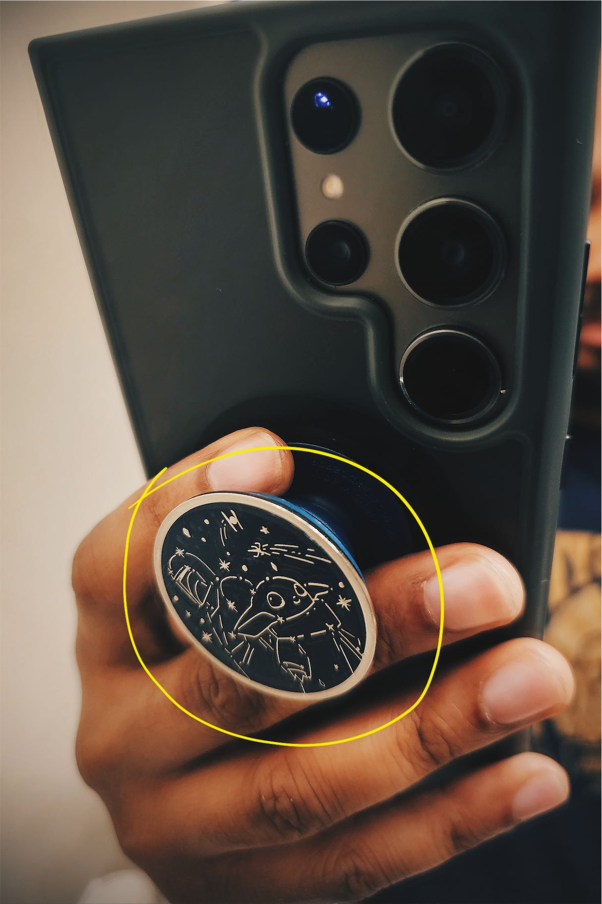

As a frontend web developer, I find myself sitting at a desk all day. Recently, that has become a challenge because of numbness, tingling, and mild pain in my arms due to ulnar nerve entrapment. Dealing with it has been a challenge. Frequent discomfort tied to things to that we love to do can be heart breaking. I have fear that if things get worse, I’ll be unable to type which would affect my livelihood. However, I try to focus on the positives and choose to take action to maximize comfort and encourage healing.

This article will go over some of this I've tried in search or relief and prevention. I hopes it helps!

<aside class="border-2 border-secondary text-secondary p-8 my-8">
⚠️ I’m a developer, not a doctor. Don’t use this article to conclude that you have it or as a diagnosis for yourself or somebody else. Go to a doctor and get it checked out. If you are experiencing something similar to this and haven’t, I feel for you and going to the doctor sucks. You should still go!
</aside>

### What is it exactly?

<blockquote>

[Ulnar nerve entrapment](https://www.osmosis.org/answers/ulnar-nerve-entrapment) is a compressive neuropathy that occurs when the [ulnar nerve](https://www.osmosis.org/learn/Anatomy_of_the_brachial_plexus) is trapped or compressed, and can lead to progressive damage. The ulnar nerve is one of the three main branches of the [brachial plexus](https://www.osmosis.org/learn/Brachial_plexus), which is a network of nerves originating from the [spinal cord](https://www.osmosis.org/learn/Nervous_system_anatomy_and_physiology) in the neck and travelling down the arm. After leaving the spinal cord, the brachial plexus runs along the axilla, and then the inner side of the arm and forearm down to the hand. [Ulnar nerve entrapment](https://www.osmosis.org/answers/ulnar-nerve-entrapment) can occur anywhere along the nerve’s length through the elbow and arms, or even distally in the hand or wrist at Guyon’s canal. The most frequent location is nerve entrapment at the elbow, which is usually caused by [cubital tunnel syndrome](https://www.osmosis.org/answers/ulnar-nerve-entrapment).

Ulnar nerve entrapment is the second most common peripheral compression neuropathy. The first, occurring much more frequently, is [carpal tunnel syndrome](https://www.osmosis.org/learn/Carpal_tunnel_syndrome). Carpal tunnel syndrome should not, however, be confused with [cubital tunnel syndrome](https://www.osmosis.org/answers/ulnar-nerve-entrapment). The syndromes are similar, both involving nerve compression at the arm, however [cubital tunnel syndrome](https://www.osmosis.org/answers/ulnar-nerve-entrapment) affects the _ulnar nerve_, while carpal tunnel syndrome affects the _[median nerve](https://www.osmosis.org/learn/Carpal_tunnel_syndrome:_Nursing)_.

</blockquote>

_[Lahav Constantini - “Ulnar Nerve Entrapment"](https://www.osmosis.org/answers/ulnar-nerve-entrapment)_

Imagine hitting your funny bone. How does that feel? Kinda uncomfortable, right? Now imagine that sensation lasting not just a few seconds, but all day. Two days. Three days or more. If you can agree that the idea of that is unpleasant, then you can see why ulnar nerve entrapment can become a big issue.

I have been living with an very mild level of entrapment for quite some time. Very minor flare up would come an ago and make some very physical movements with my arm feel strange and maybe a little tingly afterwards. It wasn’t under the start of the calendar year that things began to get worse and affect my work.

## Things tried

### Changed workouts and stretched more

I’ve been hitting the gym pretty hard in the last year and half. This is actually where my symptoms first started out and probably compounded with the desk work to make matters worse. Thankfully I was working with a personal trainer at the gym and so we immediately would adjust movements, add stretches, and modify entire workouts. After while I noticed a correlation. Overhead movements (for example: bench press and shoulder press) were quick to create numbness and discomfort. So did Arm angles at maximum contraction or completely locked out (Back squats, Farmer Carry).

This has been the most challenging part of all of this. Right when I was beginning to really see some good progress it felt like I was going to have to slow down and a lot of my motivation was lost. It really helped to have a trainer that was able to provide so many options and alternatives. There were times where I needed an extra day and there were times that I took paused for a whole week to recover. I started to stretched for longer periods before and after workouts, when I wake up in the morning, and during short work breaks throughout the day. Some of this stretching included nerve flossing / gliding.

### Went to the doctor, did a nerve test

I went to an Orthopedic doctor. They an exam that included doing specific movements that are meant to trigger symptoms (Tapping areas around the elbow, holding your arms up and squeezing). Your feedback and which movements are triggering allow them to begin to figure out if and what kind of neuropathy you are experiencing.

The doctor sold me a padded elbow sleeve (mostly covered by insurance) and I had already purchased an arm brace to wear at night that he acknowledged as a good buy and to keep using it. The arm sleeve ended being nice for when playing bass or guitar. The brace prevents me from waking up with my arm asleep/numb by keeping it fixed at a healthy angle.
After a follow up visit to the doctor and flare ups still happening, I made an appointment for a nerve test. It was a interesting test and was nervous leading up to it. It ended up not being that bad. However my test results showed that my nerves were well within normal. I’ll be doing a video explaining the nerve test specifically in the future. Look out for that for more details on my experience.

<figure class="grid grid-cols-2 gap-4">

</figure>

### Bought a pop socket and now I love them

I recently switched from an iPhone 12 Pro to a Galaxy S23 Ultra. I should’ve, but didn’t, anticipate the size and weight of the large phone. It also made me realize that the way I’ve always held iPhones might be a factor (I use my pinky as a base at the bottom during one-handed use). The extra weight made it much worse very quickly so 3 days into using the ultra I attached a Pop Socket to it. I almost regret not using one sooner.

Close up of my phone with an annotated yellow circle around the attached Pop Socket.

This was an immediate improvement. I still had an iPhone 11 for work that was closer to the weight I was used so. While the 11 wasn’t heavy, there was a level of tension I felt in my pinky that I had just gotten used to. That tension was gone w/ the phone grip.

### Changed my desk setup

Now I haven’t mentioned it yet but I was dealing with symptoms mostly in my right hand. The culprit causing flares up when working was actually the mouse! Because of this, I started exploring different arm and wrists positions and trying to hold the mouse differently. That one was kind of mute because the shape of the specific mouse makes that a little difficult. I ended up ordering a more ergonomic mouse.

Photo of the mice I've used. Annotated icons below the mice indicating the Logi Lift is the winner.

This new “sideways” mouse helped some. Some of the discomfort in my pinky went away but there was still some where my wrist rested on the desk. This led to buying a wrist rest.

Overhead photo of my desk. Annotated lines around the keyboard, mouse and wrist pad.

The wrist rest under my keyboard helped, but the one for the mouse made things worse. I then decided to try to reduce mouse usage work towards operating the computer solely with the keyboard (more on that later).

At my work office I was using an Apple Magic Mouse. I stopped using that completely and opted to bring my new mouse with me when I went into the office.

I have a standing desk at my work office. I noticed that when standing, symptoms go away almost completely. I switched to standing about 90% of the time when there. I was also taking more short breaks to stop typing, stretch and walk a little bit. Unfortunately working away from my desk with just my laptop was the worst for my symptoms. The built-in keyboard & trackpad, the sharp edge of the MacBook Pro, and poorer posture were like a trifecta meant to create flare ups. Unless I was in a meeting or taking a zoom call without any typing, I was working at my desk.

### Slowly breaking up with the mouse

This has become the most fun and exciting part of all of this. Trying to reduce mouse usage has productivity benefits that I’ve already started to noticed. There has been a lot of experimentation in this area. This could be its own article but I am thinking of also breaking this up into its own video or a series of videos.

Before all this, my friend and co-worker had been pushing me to to try vim. He thought I’d like it so every now and then he’d give me a nudge. I hadn’t really explored what vim was and how it was used, but once I decided to look into reducing mouse usage, I hit up youtube. Installed the extension for VS Code, and a few months later, I’m trying looking at going full terminal.

It has been about a month and half since I started learning vim. I am definitely still slower at certain things, and I find sometimes I end up living in `insert` mode for way longer than I should. But I’ve gotten pretty committed to practice it and can see me working way faster with it by this time next year. This has led me to wanting to learn how to properly touch type, and use more command line tools.

### Closing thoughts

Out of everything that I have tried, the changes to my desk setup and reducing mouse usage have probably been the most important and most changes I have so far. I guess that should not be surprising since I spend the most time there. This experience has really emphasized for me how important it is to prioritize good health and fitness—especially if you are someone that works at a desk. This ulnar never entrapment has led me to reevaluate my eating habits, sleeping, posture, and water intake because I think that everything is connected and I want to make sure I am providing the body with what it needs to heal and function.

I’ll also mention that there have been a few rare instances where I have taken over-the-counter ibuprofen to reduce pain. Unless I have like an infection, I don’t like to take medication often so I use painkillers very sparingly.

If you’ve reached this point, then I really hope this was helpful to you. If you’re here thinking you may have some type of ulnar nerve or any kind of nerve issue going on, I recommend getting it checked out. Everyone’s body is different enough that what I try may not work for you. It is understandable if you get discouraged but you may find it leads down a road or learning that changes your life in positive ways.
